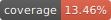

# TreeScan World Cup 2026 Preparation

[](https://github.com/epiENGAGE/TreeScan/actions/workflows/r-tests.yml)
[](https://github.com/epiENGAGE/TreeScan/actions/workflows/r-tests.yml)

[TreeScan™ v2.3](https://www.treescan.org/) for use by public health officials across the US primarily with ESSENCE-based emergency department (ED) data on ICD-10 codes to detect deviations from a baseline 90 day period. Users ideally run 99,999 Monte Carlo simulations to 
- **Goal:** Strengthen capacity to detect health issues not captured by syndromic surveillance for the US 2026 World Cup. 
- **Pre-print:** Initial analytic pipeline including R code and supporting files from the NYC Health Dept.'s [pre-print](https://doi.org/10.1101/2025.11.11.25339953) (Greene SK, Levin-Rector A, Kulldorff M, and Lall R). The authors' advice has allowed for the code expansion by Nyall Jamieson, Emily Javan, and Remy Pasco within epiENGAGE. 
- **Overview:** This repository contains an R-based TreeScan analysis pipeline in `treescan_project/` for preparing input files, running TreeScan, and generating signal interpretation outputs. For complete list of ICD-10 codes removed before analysis, such as influenza and COVID-19 codes, see `treescan_project/data/Do_not_evaluate_nodes.csv`. For a TreeScan tutorial watch [this YouTube video](https://youtu.be/Def6oYw8vog?si=hiIkwHDnUOXBbS8R).
- **Tags:** During World Cup 2026, new tagged versions of the code base will be updated Tuesday evenings, pending passed tests and no new errors introduced.

The full pipeline:

```sh
treescan_project/code/run_full_pipeline.R
```

`run_full_pipeline.R` coordinates the numbered scripts in `treescan_project/code/` and expects to be run from the TreeScan project context with the required local data, parameter files, and TreeScan binary in place.


## Testing

Testing and coverage (the percent of lines of code with a test written) tooling is separate from the TreeScan analysis pipeline and lives in `tests/`. These tests are intended to exercise reusable code and synthetic fixtures without running the full operational TreeScan workflow.

Run tests locally:

```sh
cd tests
Rscript testthat.R
```

Run coverage locally:

```sh
cd tests
Rscript coverage.R
```

To regenerate the local HTML drill-down coverage report, install `DT` and
`htmltools`, then run:

```sh
cd tests
TREESCAN_COVERAGE_HTML=true Rscript coverage.R
```

The HTML report is generated at `coverage-report/index.html` and is ignored by
git. The badge percentage is based on `coverage/coverage-summary.json`.
